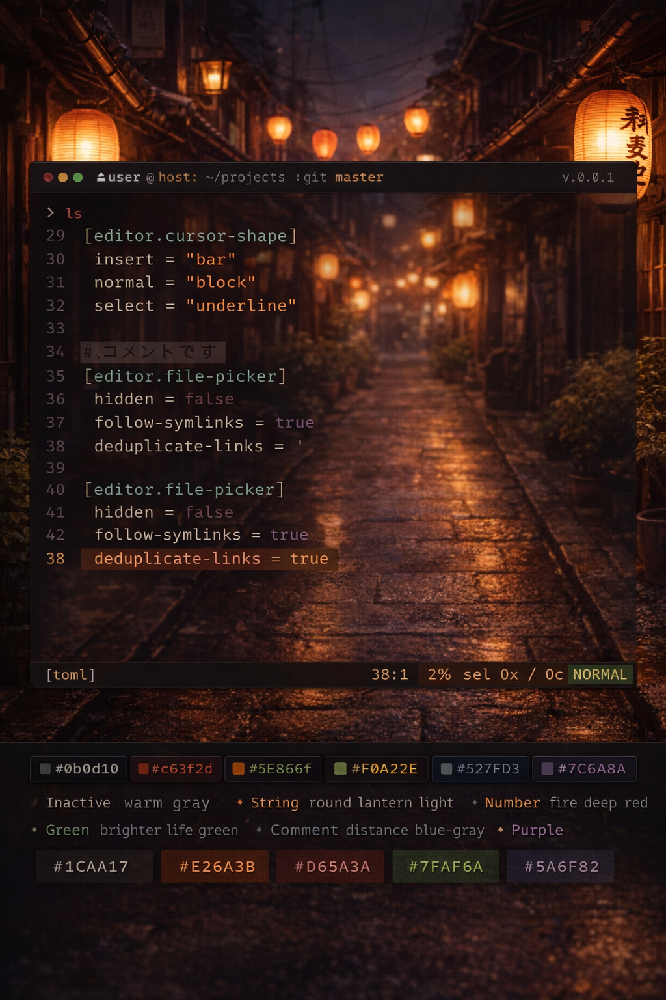

# akari-theme

A terminal color palette inspired by Japanese alleys lit by round lanterns.

Akari (灯) means *light* in Japanese.
This theme is not about darkness, rain, or neon —
it is about warm light, quiet streets, and the presence of life at night.



*Image generated by ChatGPT*

## Concept

Akari is inspired by a familiar Japanese scene:

- Narrow residential alleys
- Soft, **round lanterns** glowing above
- Wood, stone, plants, and warm shadows
- A night that feels alive, not silent

The goal is to translate this atmosphere into a terminal experience that feels calm,
warm, and readable for long sessions.

## Color Philosophy

- **Light is singular** — Only one warm color (lantern orange) serves as the primary accent
- **Blue is air, not light** — Blue represents the night sky, not a light source
- **Purple stays quiet** — Muted purple for distance, never neon
- **Green is life** — Represents plants and human presence
- **Black is gray** — True black doesn't exist in a lit alley; use warm grays instead

## Supported Tools

### Ghostty

Copy `ghostty/akari` to `~/.config/ghostty/themes/akari`, then set in your config:

```
theme = akari
```

### Helix

Copy `helix/akari.toml` to `~/.config/helix/themes/akari.toml`, then set in your config:

```toml
theme = "akari"
```

### Starship

Add the contents of `starship/palette.toml` to your `~/.config/starship.toml`, then set:

```toml
palette = 'akari'
```

### tmux

Copy `tmux/akari.conf` to `~/.config/tmux/akari.conf`, then add to your `.tmux.conf`:

```tmux
source-file ~/.config/tmux/akari.conf
```

### macOS Terminal

Double-click `terminal/Akari.terminal` to import the profile, then set it as default in Terminal > Settings > Profiles.

### zsh-syntax-highlighting

See `zsh/syntax_highlight.zsh` for configuration example.

## Palette

| Role       | Color     | Hex       |
|------------|-----------|-----------|
| Background | Warm Gray | `#1C1A17` |
| Foreground | Paper     | `#E6DED3` |
| Lantern    | Orange    | `#E26A3B` |
| Ember      | Red       | `#D65A3A` |
| Life       | Green     | `#7FAF6A` |
| Night      | Blue      | `#5A6F82` |
| Muted      | Purple    | `#7C6A8A` |
| Comment    | Gray      | `#7A7A75` |
